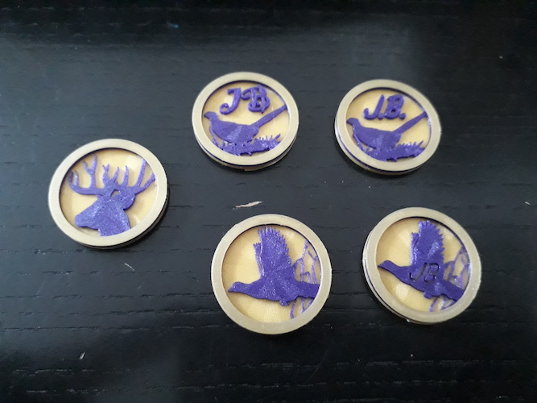
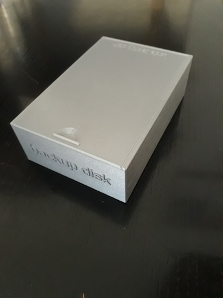
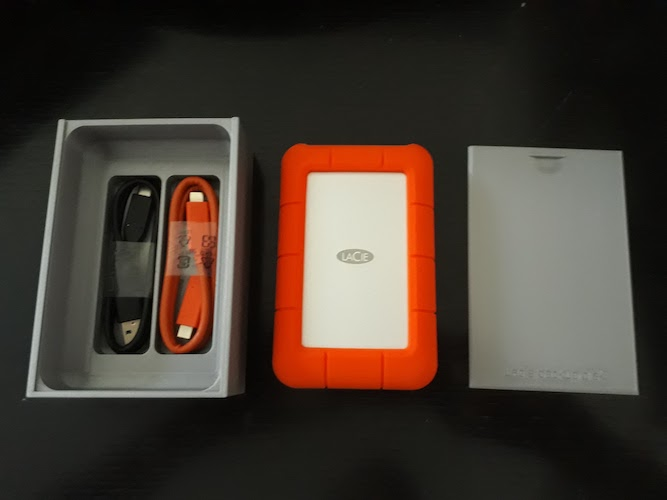
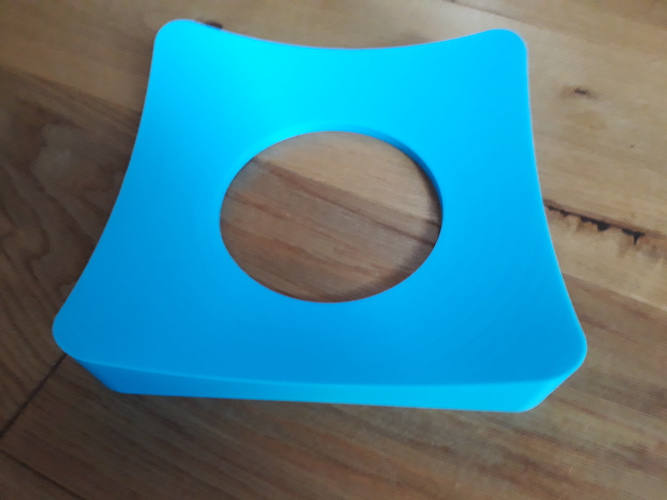
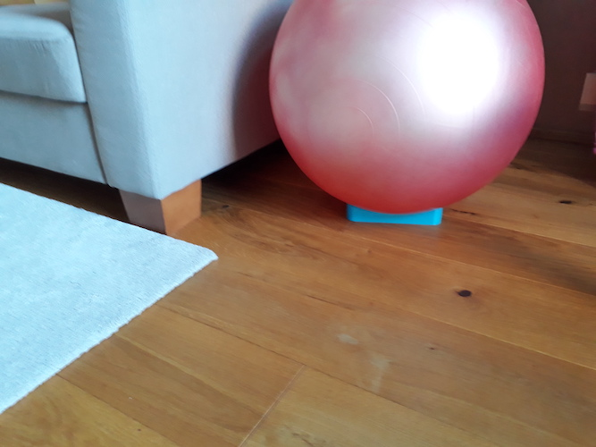
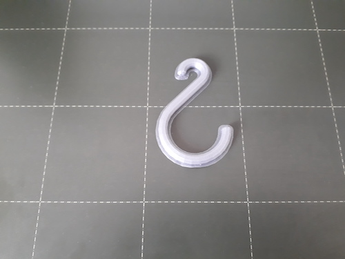

# openscad-models
Personal collection of my 3d models for print.

## b-coins
Styled tokens for shopping carts.

No supports needed.

## lacie backup disk box
Box for Lacie external disk and its cables.

No supports needed.

## Gym ball stand
Stand for gym ball (Thank you Captain Obvious)

No supports needed.

## parametric hook
Just simple two-sided hook. One can specify diameter of both sides, overhang and diameter of the "wire".

Always print with brim. No supports needed.

